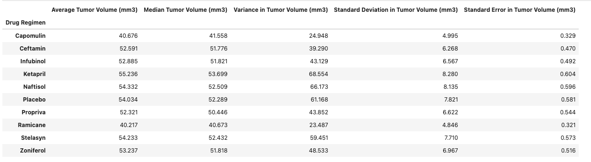
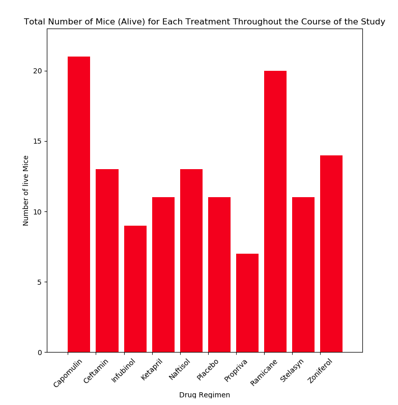
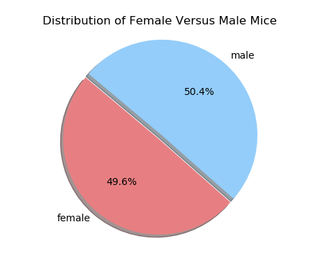
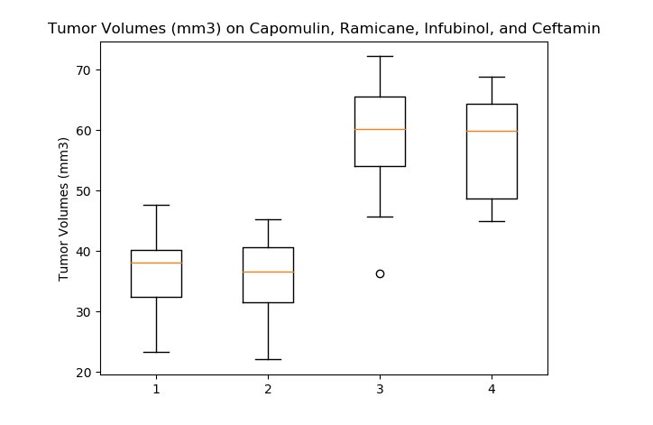
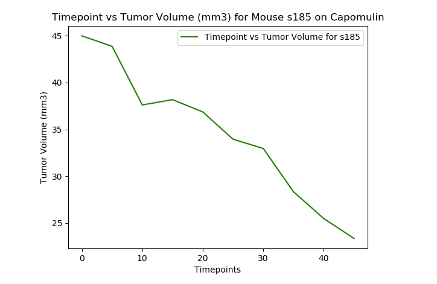
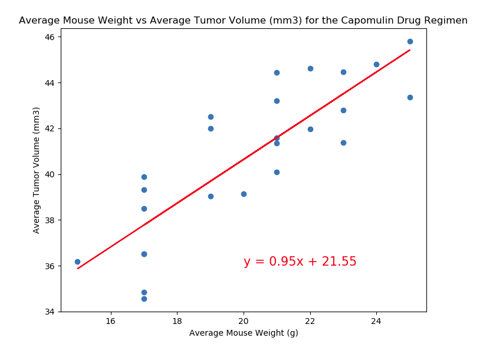

# Pymaceuticals-Inc
HW 5 in UCF Data Analytics &amp; Visualizations Bootcamp

In this assignment we use Matplotlib plots to tell a story based on a simulated real-world situation and dataset: a pharmaceutical company's latest research on its latest cancer drug. Pymaceuticals, Inc is a burgeoning pharmaceutical company based out of San Diego, currently screening for potential treatments for squamous cell carcinoma (SCC), a commonly occurring form of skin cancer.

As a senior data analyst at the company, we were  given access to the complete data from their most recent animal study. In this study, 249 mice identified with SCC tumor growth were treated through a variety of drug regimens. Over the course of 45 days, tumor development was observed and measured. The purpose of this study was to compare the performance of Pymaceuticals' drug of interest, Capomulin, versus the other treatment regimens. we were tasked by the executive team to generate all of the tables and figures needed for the technical report of the study. The executive team also asked for a top-level summary of the study results.

To do this we performed the following steps:

* Checked the data for any mouse ID(s) with duplicate time points and remove any data associated with that mouse ID, cleaned data was used for subsequent analysis.

* Generated a summary statistics table consisting of the mean, median, variance, standard deviation, and SEM of the tumor volume for each drug regimen.

* Generated a bar plot using both Pandas's DataFrame.plot() and Matplotlib's pyplot methods that showed the number of total mice for each treatment regimen throughout the course of the study (plots in either method are identical).

* Generated a pie plot using both Pandas's DataFrame.plot() and Matplotlib's pyplot methods that showed the distribution of female or male mice in the study (plots in either method are identical).

* Calculated the final tumor volume of each mouse across four of the most promising treatment regimens: Capomulin, Ramicane, Infubinol, and Ceftamin. 

* Calculated the quartiles and IQR and quantitatively determine if there are any potential outliers across all four treatment regimens.

* Using Matplotlib, generated a box and whisker plot of the final tumor volume for all four treatment regimens and highlight any potential outliers in the plot by changing their color and style.

* Generated a line plot of time point versus tumor volume for a mouse that was treated with Capomulin.

* Generated a scatter plot of mouse weight versus average tumor volume for the Capomulin treatment regimen.

* Calculated the correlation coefficient and linear regression model between mouse weight and average tumor volume for the Capomulin treatment. 

* Ploted the linear regression model on top of the previous scatter plot.

* Looked across all previously generated figures and tables and came up with the following 3 observations & insights that can be made from the data...

# Observations & Insights:

1. Based on the analysis, Capomulin was the most successful at keeping the most mice alive throughout the study with 21; HOWEVER,
2. Ramicane had the best quartile spread represting a better reduction in final Tumor Volume (mm3) AND was also succesful in keeping mice alive: EXCELLENT NEWS FOR INVESTORS!
3. Unsurprsingly, there was a positive correlation between average mouse weight and tumor volume (mm3), meaning mice with bigger tumors weighed more (probably due to their volumous tumors).
I would recommend increasing sample sizes before going to the next stage in Pymaceuticals Inc cancer studies, it would be unethical to harm any higher mammalian life forms (monkeys deserve better), however results appear promising.

I just want to clarify a couple sections of my Pymaceuticals work:

* In the Bar Charts section, I Took "throughout the course of the study" to mean the total number of mice alive by the end of timepoint 45 (the last time point) per Drug Regimen. I could not get a consensus amongst staff on the question just an idea of what the chart should look like. So I have chosen to define it as such and plotted accordingly.
* I did an extra line plot for Ramicane in order to get data to support my 2nd observation, once I got the hang of these, I was on a roll... but man, it built a lot of character.

